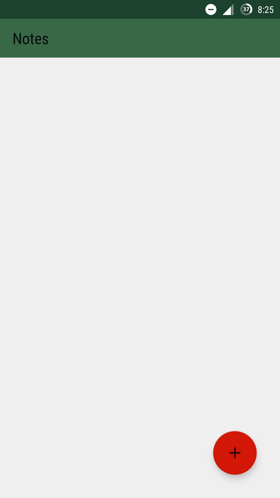
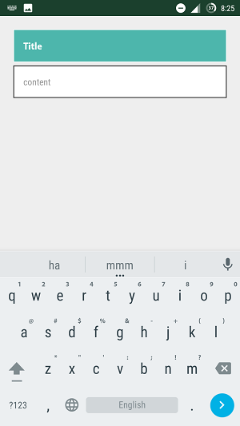
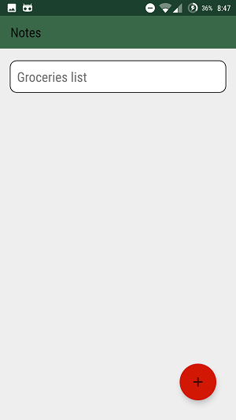

# Note Making

Note Making is a simple and plain app which could be used for taking notes, creating TODO lists,etc.
The intention of the app is to have a clear overview of all your notes and lists.
This app does not need any permissions and it takes very small space in your memory.

### Features
swipe right/left to delete the note.

### Screenshots

  
  
